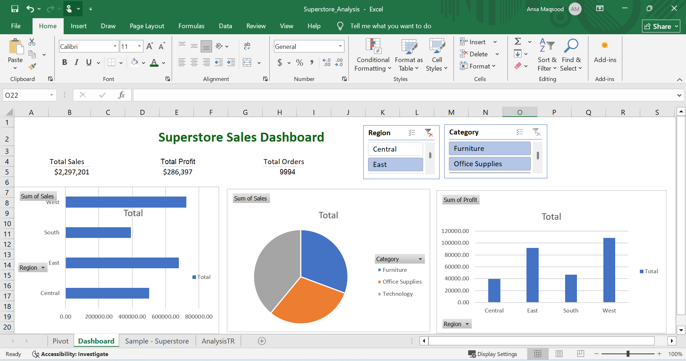

# Superstore Sales Dashboard 📊

## Project Overview
Analyzed 9,994 e-commerce sales records using Excel
to find business insights about sales, profit, and regions.

## Tools Used
- Microsoft Excel
- Pivot Tables & Pivot Charts
- SUMIFS, COUNTIFS, AVERAGEIFS
- INDEX + MATCH
- Interactive Slicers

## Key Findings
- Total Sales: $2,297,200
- Total Profit: $286,397
- Top Region: West
- Top Category: Technology

## Dashboard Preview

